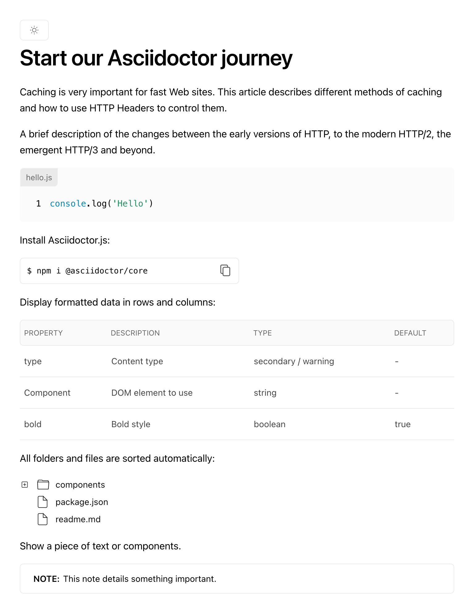
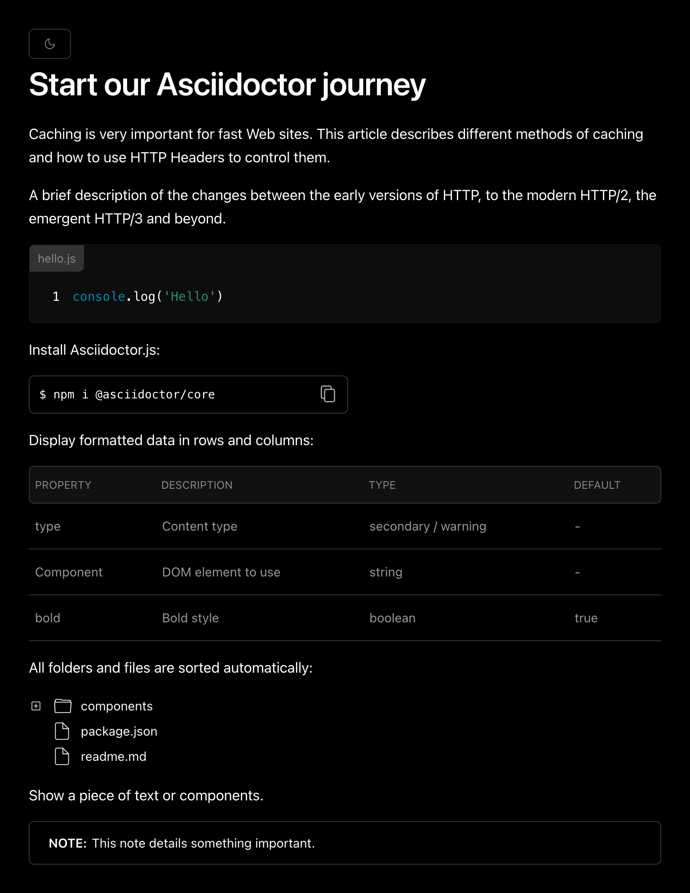

= Asciidoctor Geist

Asciidoctor.js converter based on https://github.com/geist-org/geist-ui[Geist UI].

NOTE: This is an early prototype! Only a handful of AsciiDoc features are supported.

== Demo

The screenshot below shows the output generated using the Geist converter, from an AsciiDoc document, which is stored at _docs/sample.adoc_:

It supports both light and dark mode:

== Development

Install the dependencies using: `npm i`

 $ npm run dev

== Preview

 $ npm run build
 $ npm run preview

